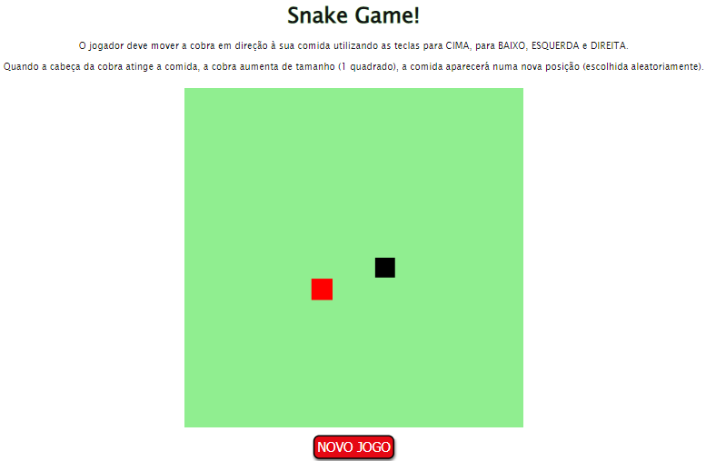
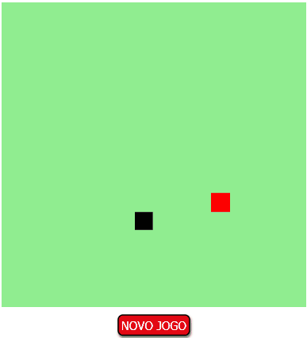

💻 Atualizado em 03 de Maio de 2021 💻

# Projeto Digital Innovation One

## Recriando o Snake Game

Este projeto foi proposto pela Digital Innovation One - Link do código original: https://github.com/SpruceGabriela/snake-the-game

## Descrição

Já pensou em criar seu próprio jogo do zero? Aprenda a desenvolver de forma simples o clássico jogo da cobrinha (Game Snake) utilizando HTML, CSS e JavaScript.

## Modificações implementadas

- Descrição do jogo;
- Regras do jogo;
- Botão para recomeçar o jogo.

## Melhorias futuras

- Implementar contador de pontos.

## 📷 Veja 📷

## Tela do jogo

## Demonstração

